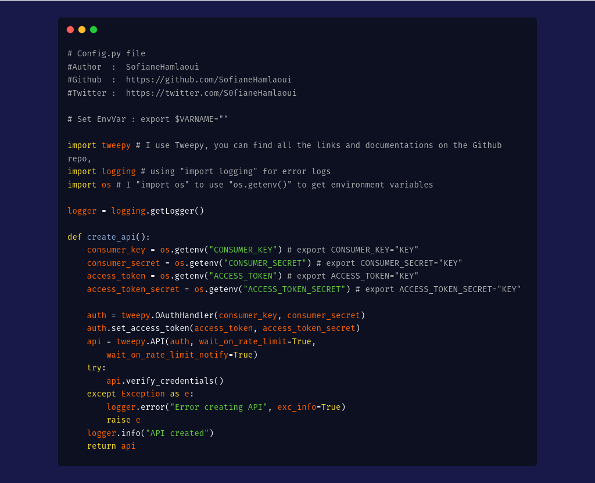
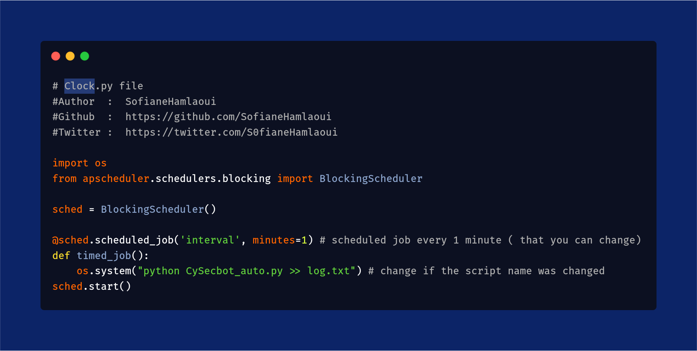
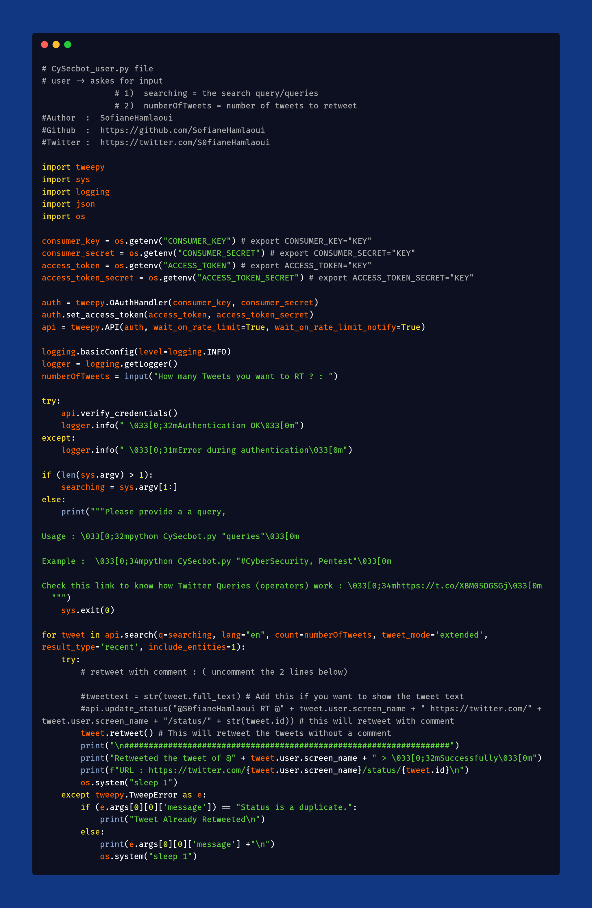
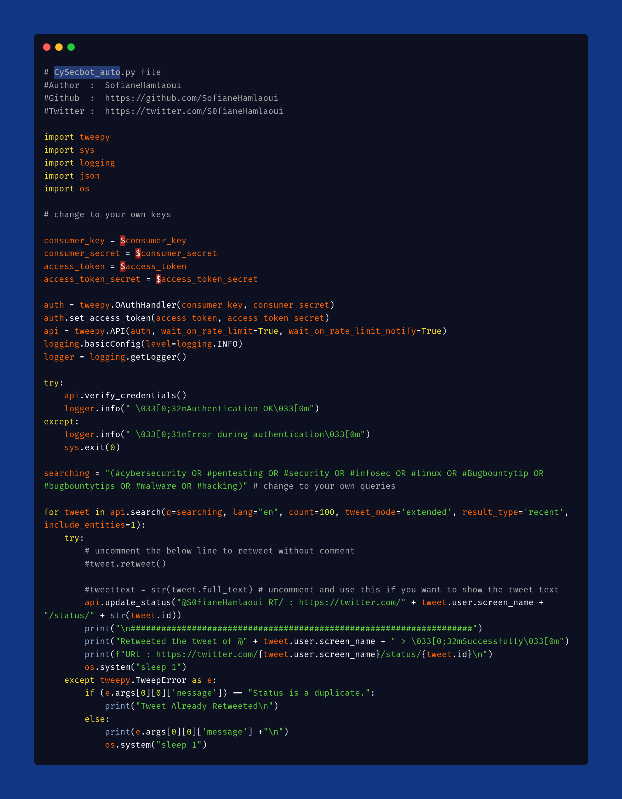

# CyberSecurityBot
## A python Twitter bot that looks for and retweet tweets cotaining the the below twitter tags :

```
#cybersecurity #pentesting #security #infosec #linux #Bugbountytip #bugbountytips #malware #hacking
```
Of course, the bot was optimized to use with other Twitter operators queries ( you can know more Twitter operators here : [Twitter Operators](https://developer.twitter.com/en/docs/tweets/rules-and-filtering/overview/standard-operators)

# Demo Video of the bot functioning :

[](https://www.youtube.com/watch?v=l3qms955nWo)

# Requirements : 

```
A Twitter developer account
tweepy
APScheduler
```
# Scheduling the bot 
***You can find on the repo 2 folders for deploying and automatizing the bot, All you have to do is changing the Clock.py file***

# Content
## Files

- ###  ***Helpers*** 

### ``` get_token.py ```
- To get "Access Token & Access Token Secret" to use the bot with another account (other than the app creator account)


***NOTE : [FOR CySecbot_user.py] AFTER GETTING THE TOKEN KEYS, YOU CAN SET THE KEY VALUES AS ENV VARIAVLES (RECOMMANDED WAY TO STORE YOUR KEYS)***

***SO YOU CAN USE DIRECTLY THE BOT USING ENV VARIABLES***

```
export CONSUMER_KEY="KEY"
export CONSUMER_SECRET="KEY"
export ACCESS_TOKEN="KEY"
export ACCESS_TOKEN_SECRET="KEY"
```
### ``` Config.py ```
- - you can use this file to configure your Access/Token keys and use them everywhere by importing the file


### ``` Clock.py ```
- - scheduling bot's job 


### ***Bot Files*** 

### ``` CySecbot_user.py ```
- - The Twitter bot, but configuring using user inputs (setting search queries && number of retweets) 



### ``` CySecbot_auto.py ```
- - The Twitter bot, that runs automaticly without user inputs (change the file to your own use case)


### ***Folders*** 

### ``` _HerukoDeploy ```
- - A folder with all required files for deploying the bot on [Heroku](https://heroku.com)

### ``` _Schedulejob ```
- - A folder with all required files for deploying the bot on a unix/linux machine 
</strong>
